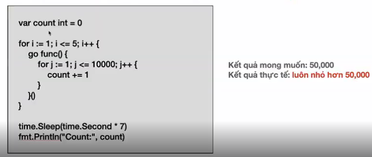
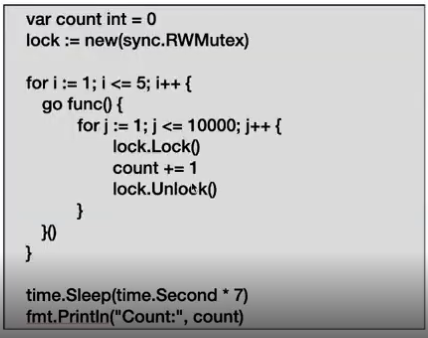
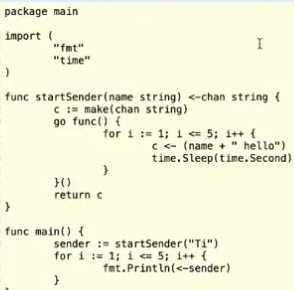

## Data Racing

- Trong môi trường Multi-Threading, cụ thể là concurrent với các Goroutines, nếu đọc và ghi vào cùng 1 biến sẽ xuất hiện lỗi "Data Racing"
  
  => bản chất của concurrent là không song song mà thread của CPU switch liên tục giữa các routine (1 thread có thể care nhiều routine)
  => Mutex Lock để giải quyết bài toàn này `sync.RWMutex`
- Tác dụng của mutex lock là:

* Goroutine nào đầu tiên vào sẽ 'chiếm lock', hàm `Lock()` sẽ block tất cả các goroutine đến sau cho tới khi nó `Unlock()`
* Từ đó chỉ có 1 goroutine trong cùng 1 thời điểm đuơc update giá trị cho biến count
  

- RWLock: block tất cả Goroutine còn lại dù là đang read hay write
- RLock: block tất cả Goroutine write, cho phép các Goroutine Read được phép truy xuất (shared lock)

## Channel Pattern

- Có 2 pattern thường thấy: pass vào func hoặc nhận về từ 1 func Goroutine
1. dạng chỉ get được data ra 